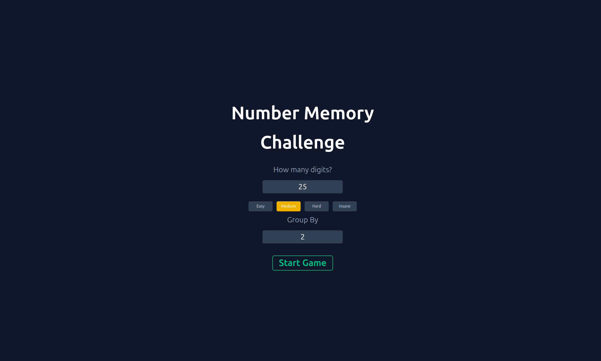

# Number Memory Challenge

A sleek and minimalist web application designed to test and improve your number memorization skills, built with Next.js and animated with Framer Motion.

## [**Live Demo: Test Your Memory Here!**](https://number-memory-app.vercel.app/)

---

### Key Features

This application offers a minimalistic and customizable user experience from start to finish.

### Screenshots

---

**Setup Screen**

**Results Screen**

- **Customizable Challenge:** Tailor the difficulty by choosing the number of digits and the grouping size.
- **Live Performance Timer:** A real-time timer tracks your memorization speed from the moment the numbers are revealed.
- **Detailed Feedback:** Get an instant, side-by-side comparison of your answer versus the correct sequence, with digits highlighted for clear feedback.
- **Smooth Animations:** Fluid transitions between game states are powered by Framer Motion to create a modern and engaging feel.

---

### Tech Stack

- **Framework:** [Next.js](https://nextjs.org/) (with App Router)
- **UI Library:** [React](https://react.dev/)
- **Language:** [TypeScript](https://www.typescriptlang.org/)
- **Styling:** [Tailwind CSS](https://tailwindcss.com/)
- **Animation:** [Framer Motion](https://www.motion.dev/)

---

### Project Highlights

As my first major project, this was a deep dive into building a complete application with a modern tech stack. Key achievements include:

- Managing complex game state, including timers, user input, and multiple game phases, using React Hooks.
- Implementing a responsive, mobile-first design system with Tailwind CSS.
- Creating a polished user experience with fluid animations using Framer Motion.
